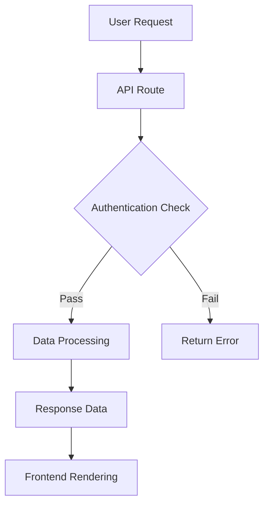

---
tags:
  - test
uuid: 115e245b-8b76-43b8-9728-472b60e47705
---

# Welcome to Helenite

This is a modern React-based Obsidian Vault viewer.

## Key Features

- 🎨 **Modern Interface** - Built with React 18 + TypeScript
- 📱 **Responsive Design** - Perfectly adapted for desktop, tablet, and mobile devices  
- ⚡ **High Performance** - Built with Vite 5
- 🎯 **Focused Reading** - Read-only mode for distraction-free content browsing

## Useful Links

Here are some useful external links:
- [React Documentation](https://react.dev/) - Learn React framework
- [TypeScript Handbook](https://www.typescriptlang.org/docs/) - TypeScript official documentation
- [Obsidian Website](https://obsidian.md) - Knowledge management tool
- [GitHub Repository](https://github.com/anthropics/claude-code) - Project source code

## Obsidian Syntax Support

### Internal Links
[[Usages]]
[[Welcome]]

### Tag System
Related tags: #react #markdown #obsidian #typescript

### Highlight
This is an example of ==important highlighted content==.

### Callouts

> [!info] Information
> This is an information callout block.

> [!tip] Usage Tips
> You can use the file browser on the left to navigate different documents.

> [!warning] Important Note
> This is read-only mode. File content cannot be edited.

> [!note] Technical Architecture
> - React 18 + TypeScript
> - Mantine UI 7 + Tailwind CSS  
> - Zustand State Management
> - Unified + Remark Markdown Processing

> [!note] Technical Architecture A
> 1. React 18 + TypeScript
> 2. Mantine UI 7 + Tailwind CSS  

## Mathematical Formulas

Inline formula: $E = mc^2$

Block-level formula:
$$\int_{-\infty}^{\infty} e^{-x^2} dx = \sqrt{\pi}$$

## Code Block Example

```javascript
// React Component Example
function MarkdownViewer() {
  const [content, setContent] = useState('');
  
  useEffect(() => {
    markdownProcessor.processWithMetadata(content)
      .then(result => {
        setRenderedContent(result.html);
      });
  }, [content]);
  
  return <div className="markdown-viewer">{renderedContent}</div>;
}
```

## Charts and Visualizations

### Mermaid Flowchart



### System Architecture Diagram

```mermaid
graph LR
    subgraph "Frontend Layer"
        A[React App]
        B[Zustand Store]
        C[API Hooks]
    end
    
    subgraph "API Layer"
        D[FileTree API]
        subgraph "Data Layer"
        D[File System]
        E[Database]
    end
    
    subgraph "Toolchain"
        F[Vite]
        G[TypeScript]
        H[ESLint]
    end
    
    A --> B
    B --> C
    C --> D
```

## Hiking Route Tracking

### GPX Track File Test

#### Lu Yu Ancient Path Loop (Inline GPX)

```gpx
<?xml version="1.0" encoding="UTF-8"?>
<gpx version="1.1" creator="Helenite" xmlns="http://www.topografix.com/GPX/1/1">
  <metadata>
    <name>Lu Yu Ancient Path Loop</name>
    <desc>A classic loop route starting from Shaokang Village, Wuqing District, Huzhou</desc>
  </metadata>
  <trk>
    <name>Lu Yu Ancient Path Hike</name>
    <desc>Total distance 9 km, elevation gain 400 m</desc>
    <trkseg>
      <trkpt lat="30.8667" lon="120.0867">
        <ele>50</ele>
        <name>Shaokang Village Starting Point</name>
      </trkpt>
      <trkpt lat="30.8700" lon="120.0900">
        <ele>120</ele>
        <name>Tea Garden Viewpoint 1</name>
      </trkpt>
      <trkpt lat="30.8750" lon="120.0950">
        <ele>200</ele>
        <name>Mountain Ridge</name>
      </trkpt>
      <trkpt lat="30.8800" lon="120.1000">
        <ele>350</ele>
        <name>Highest Point</name>
      </trkpt>
      <trkpt lat="30.8750" lon="120.1050">
        <ele>280</ele>
        <name>Tea Garden Viewpoint 2</name>
      </trkpt>
      <trkpt lat="30.8700" lon="120.1000">
        <ele>150</ele>
        <name>Downhill Road</name>
      </trkpt>
      <trkpt lat="30.8667" lon="120.0867">
        <ele>50</ele>
        <name>Back to Starting Point</name>
      </trkpt>
    </trkseg>
  </trk>
  <wpt lat="30.8667" lon="120.0867">
    <ele>50</ele>
    <name>Parking Lot</name>
    <desc>Village entrance parking lot, free parking available</desc>
  </wpt>
  <wpt lat="30.8800" lon="120.1000">
    <ele>350</ele>
    <name>Mountain Top Viewpoint</name>
    <desc>360-degree panoramic view, overlooking the entire tea garden terraces</desc>
  </wpt>
</gpx>
```

#### YAMAP Hiking Route (External GPX File)

![[Attachments/yamap_2025-04-02_08_48.gpx]]

### KML File Test

#### City Stroll Route

![[Attachments/中西citywalk.kml]]

#### Qishan Greenway Route

![[Attachments/东西佘山含地铁绿道.kml]]

#### Red Leaves

![[Attachments/红叶尚湖.gpx]]

#### a

![[Attachments/金牛道拦马墙到普安镇.kml]]

![[Attachments/金牛道拦马墙到普安镇.gpx]]

## Task List

- [x] Complete API Architecture Refactoring
- [x] Implement FileTree API
- [x] Implement Graph API
- [x] Implement File API
- [ ] Implement Search API
- [ ] Implement Tag API
- [ ] Add Search Functionality
- [ ] Optimize Mobile Experience

## References and Footnotes

Here are some important resources [^1] and technical documentation [^2].

[^1]: React Documentation: https://react.dev
[^2]: TypeScript Handbook: https://www.typescriptlang.org/docs/

## Table Support

| Feature | Status | Priority |
|---------|--------|----------|
| Dark Mode | ✅ Done | High |
| Responsive Layout | ✅ Done | High |
| File Tree | ✅ Done | High |
| Search Functionality | ⏳ In Progress | Medium |
| Tag System | ⏳ In Progress | Medium |
| Theme Customization | ❌ Todo | Low |

## Multimedia Content

### Pictures

### Horizontal Line
---

## Fun Stuff

[FIRE (Financial Independence, Retire Early) Early Retirement Financial Planning Calculator](https://fire.freedeaths.com)
[FIRE (Financial Independence, Retire Early) Early Retirement Financial Planning Calculator](https://fire.freedeaths.com)

## Contact

For any messages or feedback, please email [freedeaths@gmail.com](mailto:freedeaths@gmail.com).

> [!success] Test Completed
> This document includes most Markdown syntax and Obsidian features, making it ideal for functionality testing and demonstrations.

---

Select other files from the left sidebar to explore more content.


## Pictures

![[inversed mt fuji.png]]

## Tracks

[Leaflet plugin](https://github.com/javalent/obsidian-leaflet)

```leaflet
id: 鹤见岳
lat: 33.28
long: 131.43
defaultZoom: 14
maxZoom: 20
gpx: [[yamap_2025-04-02_08_48.gpx]]
gpxMarkers:
  start: start
  waypoint: waypoint
  end: end
```

KML


