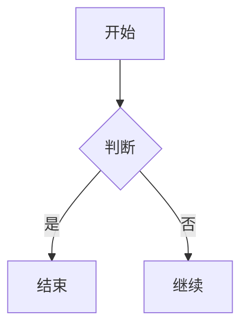

# Markdown 渲染和插件系统

## 概述

Helenite 作为 Obsidian 兼容的知识管理系统，Markdown 渲染是其最核心的功能。我们采用 **unified 生态系统的标准最佳实践**，通过完整的 AST 处理流水线，实现从原始 Markdown 到 React 组件的无缝转换。

## unified 处理流水线

### 标准处理流程

```typescript
const processor = unified()
  // Parse: Markdown → MDAST
  .use(remarkParse)
  
  // Transform: MDAST 插件处理
  .use(remarkMath)           // 数学公式 AST 处理
  .use(remarkObsidian)       // Obsidian 语法 AST 处理  
  .use(remarkTrackMap)       // 轨迹地图 AST 处理
  .use(remarkMermaid)        // 图表 AST 处理
  
  // Bridge: MDAST → HAST
  .use(remarkRehype, { allowDangerousHtml: true })
  
  // Transform: HAST 插件处理
  .use(rehypeKatex)          // 数学公式 HTML 渲染
  .use(rehypeHighlight)      // 代码高亮
  
  // Stringify: HAST → React Components
  .use(rehypeReact, {
    createElement: React.createElement,
    components: {
      mapComponent: MapComponent,         // 统一地图组件
      mermaidDiagram: MermaidComponent,   // 图表组件
    }
  });

// 输入 raw content，直接输出 React 元素
const reactElement = processor.processSync(content).result;
```

### 架构原理

```
Raw Markdown 输入
    ↓
Parse (remarkParse)
    ↓  
MDAST (Markdown AST)
    ↓
Transform (remark 插件)
    ↓
Enhanced MDAST
    ↓
Bridge (remarkRehype) 
    ↓
HAST (HTML AST)
    ↓
Transform (rehype 插件)
    ↓
Enhanced HAST
    ↓
Stringify (rehypeReact)
    ↓
React Elements 输出
```

**核心优势**: 
- ✅ **完整性**: 保持 unified 生态的完整处理流程
- ✅ **标准化**: 符合 unified 插件开发最佳实践
- ✅ **扩展性**: 通过 AST 插件精确控制转换过程
- ✅ **性能**: 单次处理，无后处理开销

## remark 插件 (MDAST 处理)

### Obsidian 语法支持

```typescript
// remarkObsidian 插件
const remarkObsidian = () => {
  return (tree: MDAST) => {
    visit(tree, (node) => {
      // 处理 [[链接]] 语法
      if (node.type === 'text' && /\[\[(.+?)\]\]/.test(node.value)) {
        // 转换为自定义 AST 节点
        node.type = 'wikiLink';
        node.data = parseWikiLink(node.value);
      }
      
      // 处理 #标签 语法
      if (node.type === 'text' && /#\w+/.test(node.value)) {
        node.type = 'obsidianTag';
        node.data = parseTag(node.value);  
      }
      
      // 处理 ==高亮== 语法
      if (node.type === 'text' && /==(.+?)==/.test(node.value)) {
        node.type = 'highlight';
        node.data = parseHighlight(node.value);
      }
    });
  };
};
```

### 地图插件 (统一地图组件)

```typescript
// remarkMap 插件 - 处理所有地图相关语法
const remarkMap = () => {
  return (tree: MDAST) => {
    visit(tree, 'code', (node: any) => {
      // 支持 ```gpx 和 ```kml 代码块 (单个轨迹)
      if (['gpx', 'kml'].includes(node.lang)) {
        node.type = 'mapComponent';
        node.data = {
          tracks: [{
            format: node.lang,
            content: node.value
          }],
          locations: [] // 单个轨迹: locations 为空
        };
      }
      
      // 支持 ```footprints 代码块 (足迹聚合)
      if (node.lang === 'footprints') {
        node.type = 'mapComponent';
        node.data = {
          tracks: [], // 从配置动态加载
          locations: [], // 从配置动态加载
          config: YAML.parse(node.value)
        };
      }
    });
    
    visit(tree, 'text', (node: any, index, parent) => {
      // 支持 ![[track.gpx]] 语法 (单个轨迹)
      const match = /^!\[\[(.+\.(gpx|kml))\]\]$/.exec(node.value);
      if (match) {
        parent!.children[index!] = {
          type: 'mapComponent',
          data: {
            tracks: [{
              src: match[1],
              format: match[2]
            }],
            locations: [] // 单个轨迹: locations 为空
          }
        };
      }
    });
  };
};
```

### 数学公式和图表

```typescript
// 数学公式 (remarkMath)
const processor = unified()
  .use(remarkMath)          // $...$ 和 $$...$$ → math 节点
  .use(rehypeKatex);        // math 节点 → KaTeX HTML

// 图表支持 (remarkMermaid)  
const processor = unified()
  .use(remarkMermaid)       // ```mermaid → mermaidDiagram 节点
  .use(rehypeReact, {
    components: {
      mermaidDiagram: MermaidComponent
    }
  });
```

## 统一地图组件设计

### 核心设计理念

**单个组件，双输入模式**：
- 单个轨迹：`tracks.length = 1, locations.length = 0`
- 足迹地图：`tracks.length >= 0, locations.length >= 0`

### 统一地图组件

```typescript
interface MapComponentProps {
  tracks: TrackData[];        // 轨迹数据数组
  locations: LocationData[];  // 省市位置数据数组
  config?: FootprintsConfig;  // 足迹配置(可选)
  title?: string;             // 地图标题
}

const MapComponent: React.FC<MapComponentProps> = ({ 
  tracks, 
  locations, 
  config,
  title 
}) => {
  // 自动计算地图边界
  const bounds = useMemo(() => 
    calculateBounds([...tracks, ...locations]), 
    [tracks, locations]
  );
  
  // 智能UI控制逻辑
  const isSingleTrack = tracks.length === 1 && locations.length === 0;
  const hasMultipleData = tracks.length > 1 || locations.length > 0;
  
  return (
    <MapContainer bounds={bounds}>
      <TileLayer />
      
      {/* 轨迹渲染层 */}
      {tracks.map(track => (
        <TrackLayer key={track.id} track={track} />
      ))}
      
      {/* 位置渲染层 - 支持访问状态区分 */}
      {locations.map(location => (
        <LocationLayer 
          key={location.id} 
          location={location} 
          visitStatus={location.visitStatus}
        />
      ))}
      
      {/* 条件渲染：单轨迹动画控制 */}
      {isSingleTrack && (
        <AnimationControl track={tracks[0]} />
      )}
      
      {/* 条件渲染：多数据聚类控制 */}
      {hasMultipleData && config?.clustering && (
        <ClusteringControl config={config.clustering} />
      )}
      
      {/* 图例和控制器 */}
      <MapLegend tracks={tracks} locations={locations} />
      <MapControls />
    </MapContainer>
  );
};
```

### 地图数据加载逻辑

```typescript
// 统一的地图数据加载 hook
const useMapData = (tracks: TrackData[], locations: LocationData[], config?: FootprintsConfig) => {
  const [isLoading, setIsLoading] = useState(false);
  const [processedTracks, setProcessedTracks] = useState<TrackData[]>([]);
  const [processedLocations, setProcessedLocations] = useState<LocationData[]>([]);
  
  useEffect(() => {
    async function loadData() {
      setIsLoading(true);
      
      try {
        // 处理轨迹数据 (如果有文件路径需要加载)
        const loadedTracks = await Promise.all(
          tracks.map(async (track) => {
            if (track.src) {
              const content = await fetch(track.src).then(r => r.text());
              return await trackDataService.parseFile(content, track.format);
            }
            return track;
          })
        );
        
        // 处理位置数据 (如果有配置需要聚合)
        let loadedLocations = locations;
        if (config) {
          const aggregated = await geoDataService.aggregateFootprints(config);
          loadedLocations = [...locations, ...aggregated.locations];
        }
        
        setProcessedTracks(loadedTracks);
        setProcessedLocations(loadedLocations);
      } finally {
        setIsLoading(false);
      }
    }
    
    loadData();
  }, [tracks, locations, config]);
  
  return { processedTracks, processedLocations, isLoading };
};
```

## 使用语法示例

### 单个轨迹地图 (TrackMap)

```markdown
# 推荐语法：Obsidian 文件嵌入
![[track.gpx]]
![[route.kml]]

# 内联内容 (小文件)
```gpx
<?xml version="1.0"?>
<gpx version="1.1" creator="Helenite">
  <trk><name>我的轨迹</name>
    <trkseg>
      <trkpt lat="39.906" lon="116.397"><ele>50</ele></trkpt>
      <trkpt lat="39.907" lon="116.398"><ele>52</ele></trkpt>
    </trkseg>
  </trk>
</gpx>
```

```kml
<?xml version="1.0" encoding="UTF-8"?>
<kml xmlns="http://www.opengis.net/kml/2.2">
  <Document>
    <Placemark>
      <name>我的位置</name>
      <Point><coordinates>116.397,39.906,0</coordinates></Point>
    </Placemark>
  </Document>
</kml>
```
```

### 足迹地图 (Footprints)

```markdown
# 足迹地图：聚合多种数据源
```footprints
# 用户输入的城市列表
userInputs:
  - beijing
  - tokyo  
  - new_york

# 附件路径（扫描照片和轨迹文件）
attachmentsPath: "@Attachments"

# 包含轨迹文件
includeTracks: true

# 可视化配置
locationType: centerPoint  # centerPoint | bounds
clustering:
  enabled: true
  maxDistance: 50  # km
  minPoints: 3

# 时间过滤（可选）
timeFilter:
  start: "2024-01-01"
  end: "2024-12-31"
```
```

### 数学公式

```markdown
行内公式: $E = mc^2$

块级公式:
$$
\int_{-\infty}^{\infty} e^{-x^2} dx = \sqrt{\pi}
$$
```

### 图表

```markdown

```

### Obsidian 语法

```markdown
[[文档名称]]           # 内部链接
[[文档|显示文本]]      # 带别名的链接
![[图片.png]]         # 图片嵌入

#编程/JavaScript      # 嵌套标签
==重要内容==          # 高亮文本

> [!note] 笔记
> 这是笔记内容

> [!warning] 警告  
> 这是警告内容
```

## MarkdownProcessor 服务

基于这个设计，MarkdownProcessor 成为一个简洁的 unified 处理器：

```typescript
class MarkdownProcessor {
  private processor = unified()
    // Parse
    .use(remarkParse)
    
    // Transform (remark 插件)
    .use(remarkMath)
    .use(remarkMermaid)  
    .use(remarkObsidian)
    .use(remarkMap)           // 统一地图插件
    
    // Bridge
    .use(remarkRehype, { allowDangerousHtml: true })
    
    // Transform (rehype 插件)
    .use(rehypeKatex)
    .use(rehypeHighlight)
    .use(rehypeSlug)
    
    // Stringify
    .use(rehypeReact, {
      createElement: React.createElement,
      components: {
        mapComponent: MapComponent,        // 统一地图组件
        mermaidDiagram: MermaidComponent,
        wikiLink: WikiLinkComponent,
        obsidianTag: TagComponent,
        highlight: HighlightComponent,
      }
    });

  // 输入 raw content，输出 React 元素
  process(content: string): ReactElement {
    return this.processor.processSync(content).result as ReactElement;
  }
  
  // 异步处理 (用于大文件)
  async processAsync(content: string): Promise<ReactElement> {
    const result = await this.processor.process(content);
    return result.result as ReactElement;
  }
}
```

## 性能优化策略

### 组件懒加载

```typescript
// 按需加载重型组件
const LazyTrackMap = React.lazy(() => import('./TrackMapComponent'));
const LazyFootprints = React.lazy(() => import('./FootprintsComponent'));
const LazyMermaid = React.lazy(() => import('./MermaidComponent'));

// rehypeReact 配置
.use(rehypeReact, {
  components: {
    trackMap: (props) => (
      <Suspense fallback={<div>加载地图中...</div>}>
        <LazyTrackMap {...props} />
      </Suspense>
    ),
    footprintsMap: (props) => (
      <Suspense fallback={<div>加载足迹地图中...</div>}>
        <LazyFootprints {...props} />
      </Suspense>
    )
  }
});
```

### AST 缓存

```typescript
class MarkdownProcessor {
  private astCache = new Map<string, MDAST>();
  
  process(content: string): ReactElement {
    const contentHash = this.getContentHash(content);
    
    let ast = this.astCache.get(contentHash);
    if (!ast) {
      // 只缓存到 AST 阶段，组件渲染不缓存
      ast = this.processor.parse(content);
      this.astCache.set(contentHash, ast);
    }
    
    // 从 AST 继续处理到 React 组件
    return this.processor.runSync(ast) as ReactElement;
  }
}
```

## 错误处理

```typescript
// 插件错误边界
const PluginErrorBoundary = ({ pluginName, children }) => {
  return (
    <ErrorBoundary
      fallback={
        <div className="plugin-error">
          <h4>插件渲染失败: {pluginName}</h4>
          <p>请检查语法或联系管理员</p>
        </div>
      }
    >
      {children}
    </ErrorBoundary>
  );
};

// 在 rehypeReact 中使用
.use(rehypeReact, {
  components: {
    trackMap: (props) => (
      <PluginErrorBoundary pluginName="TrackMap">
        <TrackMapComponent {...props} />
      </PluginErrorBoundary>
    )
  }
});
```

---

**总结**: 基于 unified 最佳实践的新架构，通过完整的 AST 处理流水线，实现了从 Markdown 到 React 组件的无缝转换。TrackMap 作为 Footprints 的功能子集，共享统一的地图渲染架构，提供了强大的扩展性和一致的用户体验。