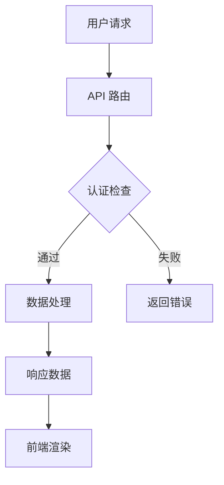
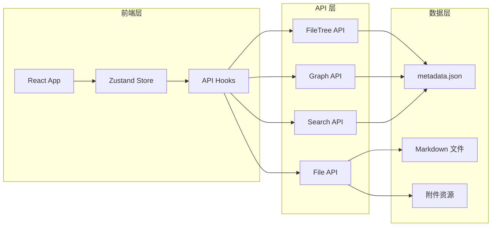

---
tags:
  - test
uuid: 115e245b-8b76-43b8-9728-472b60e47705
---

# 欢迎来到 Helenite

这里是一个基于 React 的现代化 Obsidian Vault 查看器。

## 主要特性

- 🎨 **现代化界面** - 基于 React 18 + TypeScript 构建
- 📱 **响应式设计** - 完美适配桌面端、平板和移动设备  
- ⚡ **高性能** - 使用 Vite 5 构建系统
- 🎯 **专注阅读** - 只读模式，专注内容浏览

## 相关链接

这里是一些有用的外部链接：
- [React 官方文档](https://react.dev/) - 学习 React 框架
- [TypeScript 手册](https://www.typescriptlang.org/docs/) - TypeScript 官方文档
- [Obsidian 官网](https://obsidian.md) - 知识管理工具
- [GitHub 仓库](https://github.com/anthropics/claude-code) - 项目源码

## Obsidian 语法支持

### 内部链接
查看 [[Dream-Destinations]] 了解更多旅行计划，或者访问 [[Multi-agent]] 查看技术项目。

### 标签系统
相关标签：#react #markdown #obsidian #typescript

### 高亮显示
这是一个 ==重要的高亮内容== 示例。

### Callouts

> [!info] 信息提示
> 这是一个信息类型的 callout 块。

> [!tip] 使用技巧
> 你可以使用左侧的文件浏览器来导航不同的文档。

> [!warning] 注意事项
> 这是只读模式，无法编辑文件内容。

> [!note] 技术架构
> - React 18 + TypeScript
> - Mantine UI 7 + Tailwind CSS  
> - Zustand 状态管理
> - Unified + Remark Markdown 处理

> [!note] 技术架构 A
> 1. React 18 + TypeScript
> 2. Mantine UI 7 + Tailwind CSS  

## 数学公式支持

内联公式：$E = mc^2$

块级公式：
$$\int_{-\infty}^{\infty} e^{-x^2} dx = \sqrt{\pi}$$

## 代码块示例

```javascript
// React 组件示例
function MarkdownViewer() {
  const [content, setContent] = useState('');
  
  useEffect(() => {
    markdownProcessor.processWithMetadata(content)
      .then(result => {
        setRenderedContent(result.html);
      });
  }, [content]);
  
  return <div className="markdown-viewer">{renderedContent}</div>;
}
```

## 图表和可视化

### Mermaid 流程图



### 系统架构图



## 户外路线追踪

### GPX 轨迹文件测试

#### 陆羽古道环线 (内联 GPX)

```gpx
<?xml version="1.0" encoding="UTF-8"?>
<gpx version="1.1" creator="Helenite" xmlns="http://www.topografix.com/GPX/1/1">
  <metadata>
    <name>陆羽古道环线</name>
    <desc>湖州吴兴区稍康村出发的经典环线路线</desc>
  </metadata>
  <trk>
    <name>陆羽古道徒步</name>
    <desc>全程9公里，爬升400米</desc>
    <trkseg>
      <trkpt lat="30.8667" lon="120.0867">
        <ele>50</ele>
        <name>稍康村起点</name>
      </trkpt>
      <trkpt lat="30.8700" lon="120.0900">
        <ele>120</ele>
        <name>茶园观景台1</name>
      </trkpt>
      <trkpt lat="30.8750" lon="120.0950">
        <ele>200</ele>
        <name>山脊线</name>
      </trkpt>
      <trkpt lat="30.8800" lon="120.1000">
        <ele>350</ele>
        <name>最高点</name>
      </trkpt>
      <trkpt lat="30.8750" lon="120.1050">
        <ele>280</ele>
        <name>茶园观景台2</name>
      </trkpt>
      <trkpt lat="30.8700" lon="120.1000">
        <ele>150</ele>
        <name>下山路</name>
      </trkpt>
      <trkpt lat="30.8667" lon="120.0867">
        <ele>50</ele>
        <name>回到起点</name>
      </trkpt>
    </trkseg>
  </trk>
  <wpt lat="30.8667" lon="120.0867">
    <ele>50</ele>
    <name>停车场</name>
    <desc>村口停车场，可免费停车</desc>
  </wpt>
  <wpt lat="30.8800" lon="120.1000">
    <ele>350</ele>
    <name>山顶观景台</name>
    <desc>360度全景，可俯瞰整个茶园梯田</desc>
  </wpt>
</gpx>
```

#### YAMAP 徒步路线 (外部 GPX 文件)

![[Attachments/yamap_2025-04-02_08_48.gpx]]

### KML 文件测试

#### 城市漫步路线

![[Attachments/中西citywalk.kml]]

#### 佘山绿道路线

![[Attachments/东西佘山含地铁绿道.kml]]

#### 红叶

![[Attachments/红叶尚湖.gpx]]

#### a

![[Attachments/金牛道拦马墙到普安镇.kml]]

![[Attachments/金牛道拦马墙到普安镇.gpx]]

## 任务列表

- [x] 完成 API 架构重构
- [x] 实现 FileTree API
- [x] 实现 Graph API
- [x] 实现 File API
- [ ] 实现 Search API
- [ ] 实现 Tag API
- [ ] 添加搜索功能
- [ ] 优化移动端体验

## 引用和脚注

这里引用了一些重要的资源[^1]，以及技术文档[^2]。

[^1]: React 官方文档: https://react.dev
[^2]: TypeScript 手册: https://www.typescriptlang.org/docs/

## 表格支持

| 功能 | 状态 | 优先级 |
|------|------|--------|
| 文件浏览 | ✅ 完成 | 高 |
| Markdown 渲染 | ✅ 完成 | 高 |
| 图谱可视化 | ✅ 完成 | 中 |
| 搜索功能 | 🚧 开发中 | 中 |
| 标签系统 | ⏳ 计划中 | 低 |

## 多媒体内容

### 图片


### 分隔线
---

## 小玩意儿

[FIRE(Financial Independence, Retire Early) 提前退休财务规划计算器](https://fire.freedeaths.com)

## 联系方式

如需留言或反馈，请发送邮件至 [freedeaths@gmail.com](mailto:freedeaths@gmail.com)。

> [!success] 测试完成
> 这个文档包含了大部分 Markdown 语法和 Obsidian 特性，适合用于功能测试和展示。

---

选择左侧的其他文件来浏览更多内容。
